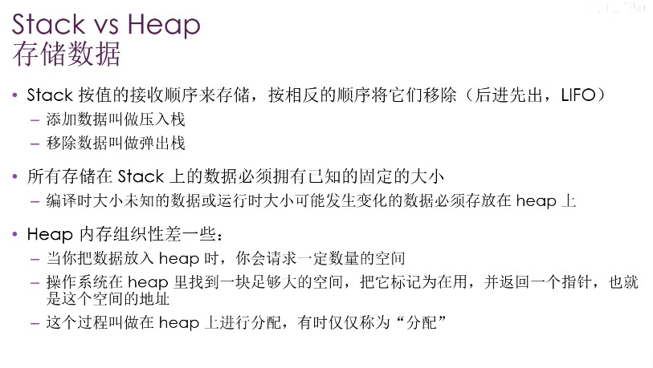
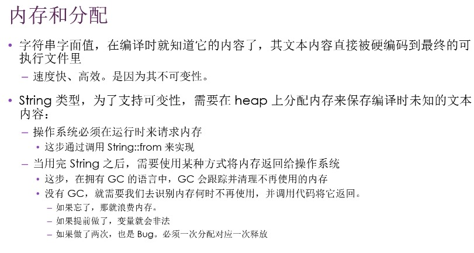
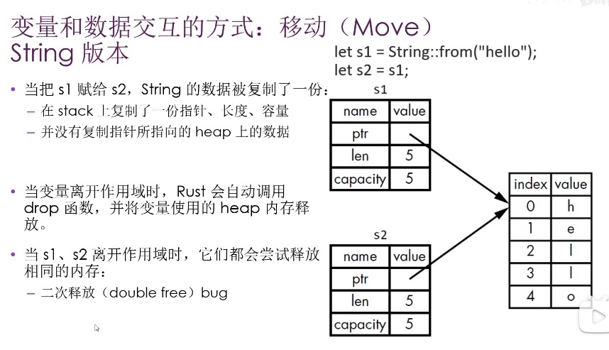
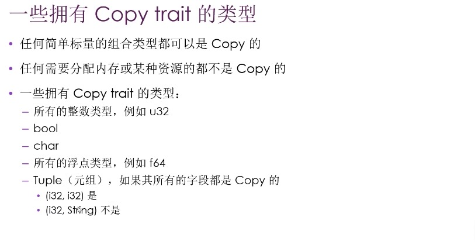
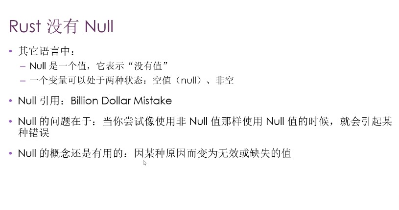
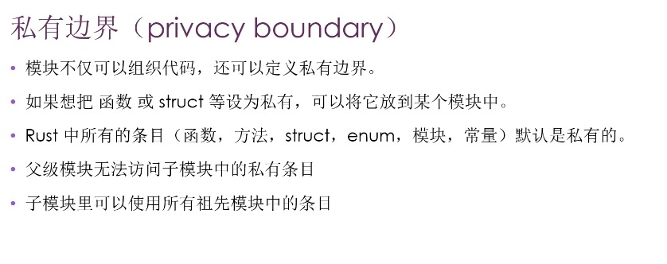
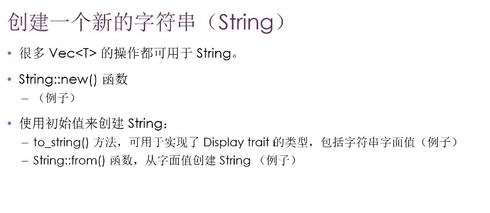
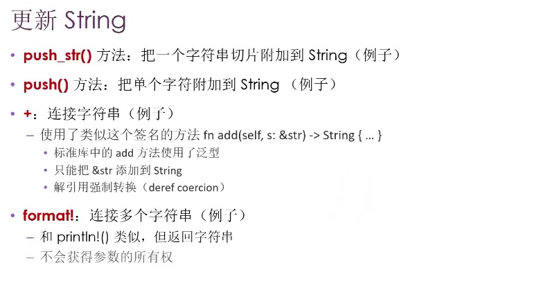
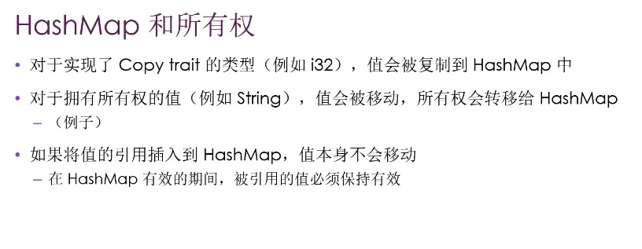
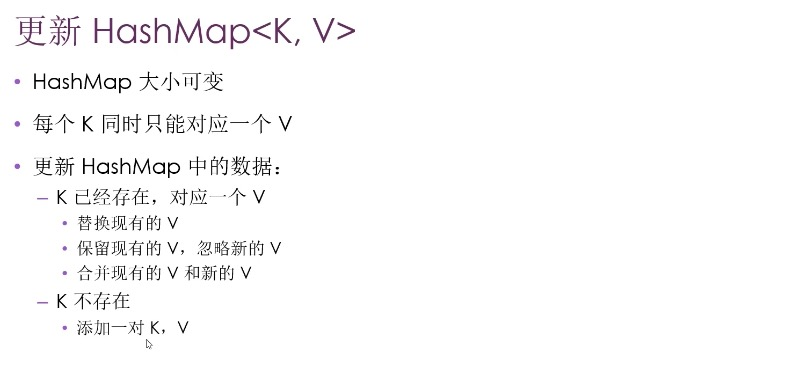

# Rust training

- code: code for the training
- tide: code for the tide
- rust-by-pratice: code for the pratice

- markdown 预览快捷键：cmd + k 再按V键

- 所有权-最独特的特性，无需GC就可以保证内存安全
- 采用所有权系统来管理，+编译器检查，不会产生任何的运行时开销
    - 每个值都有一个变量，这个变量是这个值的所有者
    - 每个值同时只能有一个所有者
    - 当所有者超出作用域时，该值将被删除

    - 
    - 
    - 
    - 

- 所有权存在的原因：
    - 跟踪代码的哪些部分正在使用 heap 的哪些数据
    - 最小化heap上的重复数据量
    - 清理 heap 上未使用的数据以避免空间不足
        - 管理 heap 数据

- 变量和数据交互的方式
    - 移动 Move，指针复制
    - clone 数据内容复制
    - 复制 - 整数类型，实现 copy trait(不能同时实现 drop trait)
- 所有权和函数
    - 将值传递给函数将发生移动或复制
    - 函数在返回值的过程中也会发生所有权的转移
- 引用的规则（满足下列条件之一）
    - 只有一个可变的引用
    - 任意数量不可变引用
    - 引用必须一直有效
    - 变量和引用一样，默认都是不可变的 加 mut

- 将数据附加到枚举的变体中
    - enum IpAddr {
        V4(String),
        V6(String),
    }
    - enum Option<T> {
        Some(T),
        None,
    }

    - 
    - 绑定值的模式匹配

- module 控制作用域和私有性
    - 
    - 同级可以互相调用，不同级的子模块可以调用父模块
    - super, pub struct, pub enum
        - struct 中字段是私有的，公共 enum 中变体默认是公有的

- use 的使用习惯
    - 函数：将函数的父级模块引入作用域（指定到父级）
    - struct、enum 指定完整路径（指定到本身）
    - 同名条目：指定到父级

- pub use ：重导出
    - 将条目引入到作用域（使用 use 后，在作用域内是私有的）
    - 将条目可以被外部代码引入到他们的作用域
    - use std::io{ self, Write }

- 将模块内容移动到其他文件
    - 模块定义时，如果模块后面是 ; ,而不是代码块。
    - Rust 会从与模块同名的文件中加载内容
    - 模块树的结构不会变化

- vector 创建方法
    - Vec::new()
    - vec![2, 3, 4, 5]

- String 创建方法
    - 
    - 

- 
- 
