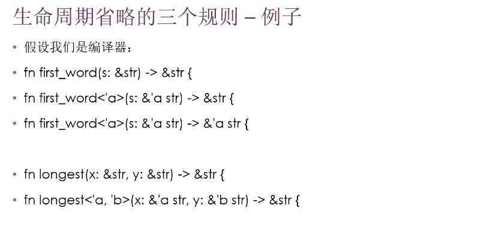

# 泛型
- 提高代码复用能力，处理重复代码的问题
    - 泛型是具体类型或其他属性的抽象代替
    - 模板，占位符
    - 编译时替换为具体的类型

- 函数中定义的泛型
    - fn largest<T>(list: &[T]) -> T {}

- 结构体中的泛型，字段持有泛型数据类型
    - struct Point<T> {x: T, y: T}
    - struct Point<T, U> {x: T, y: U}

- enum 中的泛型，变体持有泛型数据类型
    - enum Option<T> { Some(T), None }
    - enum Result<T, E> { Ok(T), Err(E) }

- 方法中的泛型
    - 为 struct 和 enum 中实现方法的时候，可在定义中使用泛型
    - 注意：
        - 把 T 放在 impl 关键字后，表示在类型 T 上实现方法
            - impl<T> Point<T>
        - 只针对具体类型实现方法（其余类型没有实现该方法）
            - impl Point<i32>
    - struct 里的泛型类型参数可以和方法的泛型类型参数不同

- 泛型代码的性能
    - 使用泛型和使用具体类型代码的性能一样
    - 单态化
        - 在编译时将泛型替换为具体的类型的过程

# Trait
- 某种类型具有哪些并且可以和其他类型共享的功能
    - 抽象的定义共享行为

- trait bound（约束）：泛型类型参数指定为实现了特定行为的类型
    - 
    - 默认实现 在 trait 中实现方法，具体类型中不实现
    - 默认实现的方法中可以调用trait中其他的方法，即使这个方法没有默认实现
    - 注意：无法从方法的重写实现中调用默认的实现(与实际不符合)

- Trait 作为参数
    - impl trait 适用于简单情况 
        - pub fn notify(item: impl Summary)
    - trait bound 适用于复杂情况
        - pub fn notify1<T: Summary>(item: T)
    - 使用 + 指定多个 bound
        - pub fn notify(item: impl Summary + Display)
        - pub fn notify1<T: Summary + Display>(item: T)
    - 使用 where 子句
        - where T: Summary + Display, U: Clone + Display,

- trait 作为返回类型
    - pub fn notify(item: &str) -> impl Summary { }
    - impl trait 只能返回确定的同一种类型

- trait 注意：
    -

# 生命周期
- 定义：
    - 
    - 生命周期存在的主要目的是：避免悬垂引用
    - 借用检查器
- 标注语法
    - 生命周期的标注并不会改变引用的生命周期长度
    - 描述了多个引用的生命周期间的关系，不影响生命周期
    - 当指定了泛型生命周期参数，函数可以接收带有任何生命周期的引用
    - 位置：在引用的 & 符号后面，使用空格将标注和引用类型分开
        - &i32 一个引用，&'a i32 带有显式生命周期的引用，&‘a mut i32 带有显式生命周期的可变引用
- 省略规则：
    -
    -
- 方法定义中的生命周期标注
    - 