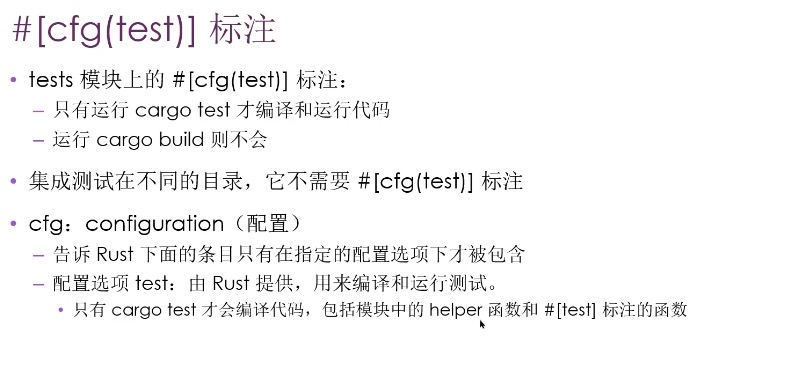

# 测试
- 新开线程跑测试用例
    - 正常 测试通过
    - 失败，抛出 panic，主线程监听到测试线程 panic

- assert!, assert_eq!, assert_ne!
    - 添加可选的自定义消息
    - assert! 第一个参数必选，第二个自定义消息参数可选
    - assert_eq!, assert_ne! 前两个参数必选，第三个自定义消息参数可选
    - 自定义消息参数会被传递给 format! 宏，可以使用{} 占位符
        - assert!(
            greeting.contains("YYY"),
            "Greeting didn't contain name '{}'",
            greeting
        );

- 验证错误处理的情况
    - 可验证代码在特定情况下是否发生 panic
    - 添加 should_panic attribute 
        - 函数 panic 测试通过
        - 函数没有 panic，测试失败

    - #[should_panic(expected="contains content")] 
        - 增加判断 panic 的类型

- 在测试中使用 Result<T, E>
    - 无需 panic 使用 Result<T, E>作为返回类型编写测试
    - 返回 Ok 测试通过
    - 返回 Err 测试失败
    - 不能使用 should_panic，因为不会 panic

- 控制测试运行命令（添加命令行参数）
    - 默认行为
        - 并行运行
        - 所有测试
        - 不显示所有输出，println 语句
    - 命令行参数
        - 针对 cargo test 的参数，紧跟 cargo test 之后
        - 针对测试可执行程序，放在 -- 之后
        - cargo test --help
        - cargo test -- --help
        - cargo test -- --test-threads=1 串行执行
    - 显式函数输出
        - 成功不会打印，执行 cargo test -- --show-output
        - 失败会打印
    - 单个测试 
        - cargo test 测试名称
        - 多个测试 指定测试名的一部分，匹配
    - 忽略测试 ignore

- 测试分类
    - 单元测试 可以测试私有函数
    - 
    - 集成测试
        - 在 tests 目录中，每个测试文件都是一个单独的 crate
        - binary crate 独立运行 